```{r setup, include=FALSE}
library(tidyverse)
library(knitr)
library(readxl)
library(shiny)

example_userdat_dir <-
  Sys.getenv("DANIEL_USERDAT_DIR") %>%
  paste0("/example/")

example_db_dir <-
  Sys.getenv("DANIEL_DB_DIR") %>%
  paste0("/example/")

opts_chunk$set(
  echo = FALSE,
  warning = FALSE,
  message = FALSE,
  comment = NA # remove prefix hashes in output
)
```

<script>MathJax.Hub.Queue(["Typeset", MathJax.Hub]);</script>

# Tutorial
Here we give a brief introduction about how to use this web server to analyze ITS amplicon data.

> The aim of this tutorial is to explain the overall workflow and not to exercise a real world ITS analysis.
> For instance, the provided samples are sub sampled to speed up the analysis.

<ul>
<li><a href="#the-biology-of-its-sequencing"><i class="fas fa-vial"></i> The Biology of ITS sequencing</a></li>
<li><a href="#input-uploading-samples"><i class="fas fa-file"></i> Input: Uploading samples</a></li>
<li><a href="#start-setting-parameters-and-starting-the-pipeline"><i class="fas fa-play"></i> Start: Setting parameters and starting the pipeline</a></li>
<li><a href="#logs"><i class="fas fa-receipt"></i> Logs</a></li>
<li><a href="#result-pages">Result pages</a></li>
<li><a href="#quality-control-qc"><i class="fas fa-shield-alt"></i> Quality Control (QC)</a></li>
<li><a href="#denoising"><i class="fas fa-align-center"></i> Denoising</a></li>
<li><a href="#phylotyping"><i class="fab fa-pagelines"></i> Phylotyping</a></li>
<li><a href="#feature-generation"><i class="fas fa-chart-pie"></i> Feature generation</a></li>
<li><a href="#correlation-networks"><i class="fas fa-project-diagram"></i> Correlation Networks</a></li>
<li><a href="#statistics"><i class="fas fa-chart-bar"></i> Statistics</a></li>
<li><a href="#machine-learning-ml"><i class="fas fa-cogs"></i> Machine Learning (ML)</a></li>
<li><a href="#summary"><i class="fas fa-file-alt"></i> Summary</a></li>
<li><a href="#references">References</a></li>
</ul>

## <i class="fas fa-vial"></i> The Biology of ITS sequencing
The Internal transcribed spacer (ITS) is a region in the eukaryotic genome between the genes coding for the small-subunit rRNA and the large-subunit rRNA.
The ITS1 sub region in fungi is located between 18S and 5.8S rRNA genes, whereas ITS2 is between 5.8S and 28S rRNA genes.
ITS regions are widely used in taxonomy due to these reasons:

- The sequence has a high degree of variation, especially between closely related species
- The size of one sub region can be easily covered with PE NGS reads
- There are universal primers available in which most fungal clades can be easily amplified

Often there are multiple copies of ITS in the same genome. However, they tend to undergo concerted evolution via unequal crossing-over events.
This preserves the sequence homogeneity within a particular genome.

Most projects in the field of metagenomics have only one the two sub regions sequenced.
It is not recommended to compare abundance levels between projects using different sub regions due to PCR amplification bias.
Besides ITS, other marker sequences e.g. translational elongation factor 1α (TEF1α) are also used for taxonomic profiling.
These markers are not covered by this webserver.
However, sometimes multiple marker genes have to be sequenced for precisely taxonomic annotation up to the species level.
This is also up to the clade of interest: It is usually more difficult to classify molds than yeasts using ITS region only.

## <i class="fas fa-file"></i> Input: Uploading samples
In this tutorial we will demonstrate how to analyze the different fungal communities in fecal and environmental samples.
Totaling 38 samples will be analyzed from these cohorts:

- 5 fecal samples from cancer patients (ENA study PRJEB33756)
- 20 fecal samples from healthy individuals of the HMP cohort [@pmid29178920]
- 13 environmental samples from a neonatal intensive care unit (NICU) [@pmid30905830]

### Start a new project

> If you just want to learn about the workflow, you do not need to start a new project.
> All results can be already accessed on the left sidebar if the current project ID is `example`.

1. Click on <i class="fas fa-file"></i> Home on the sidebar and then on <span style="color:#2a59a6">Start project</span> to create a new project.
1. This will create a new ID for your project.
This ID can be used to access the results later on by clicking on <span style="color:#2a59a6">Resume project</span>.
You can also create a bookmark of any page: The ID is always included in the URL.
1. Download the example raw data used in this tutorial:

<a class="btn btn-default shiny-download-link shiny-bound-output" href="tutorial/example.zip" target="_blank" download="">
   <i class="fa fa-download"></i>Example raw data (ZIP)
</a>

### Composing the sample meta data table

The meta data table is a spreadsheet describing the samples.
It must be provided either as a Excel spreadsheet (.xlsx) or as a comma-separated values text file (.csv)
It must contain at least one column called `sample_id` listing the ids of all uploaded samples.
For machine learning, column names must contain alphanumerical characters only (e.g. no `+` or `/`).

Additional samples can be added from databases like the NCBI Sequence Read Archive [(SRA)](https://www.ncbi.nlm.nih.gov/sra).
The meta data table will be automatically updated for those samples.
However, one can annotate external samples using the meta data table.
Here, `sample_id` must be the NCBI SRA id e.g. `SRR5098710`.
We will do this for the 20 fecal samples from healthy individuals of the HMP cohort [@pmid29178920].
For instance, we will assign these samples to the project `healthy feces`.

Raw read files can contain multiple samples, because this webserver is able to perform  *demultiplexing*.
However, one has to declare the multiplexed samples in the meta data table.
Let's have a look at the first lines of the multiplexed raw read file `muxed_S4_S5_1.fq.gz` in FASTQ format:
```{bash}
zcat $DANIEL_DB_DIR/example/reads/muxed_S5_S6_1.fq.gz | head | cut -c 1-80
```
The bar code sequence is located at the end of the header of each read (every 4th line).
We need a mapping table to know which bar code belongs to which sample.
In this example, bar code `CAGTGCATATGC` belongs to sample S4.
This is usually determined during library preparation.
We have to add two new columns to the meta data table for all multiplexed samples:
```{r}
tibble::tibble(
  sample_id = c("S4", "S5"),
  barcode_seq = c("CAGTGCATATGC", "TCACGGGAGTTG"),
  barcode_file = c("muxed_S4_S5", "muxed_S4_S5")
) %>%
  kable(caption = "Part of meta data table describing the demultiplexing")
```
Column `barcode_seq` describes the bar code sequence to look for.
Tis can be any substring of the header line.
Column `barcode_file` indicates in which file the sample was sequenced.

In order to define groups e.g. for statistics, we define also a few other columns.
The columns can contain character strings (e.g. `project`), binary values (`FALSE` or `TRUE` e.g. `low_seqdepth`) or numbers (e.g. sequencing depth `seqdepth`).
If a column contains unique values only (e.g. `library`), it will not be used in any statistical analysis due to lacking replica.
This columns will be ignored instead.
We can provide another column called `pair_id` used for *paired* testing of differences.
This is needed e.g. if the same subjects were sequenced multiple times.

Here is the content of the meta data file `samples.xlsx` to be uploaded:

```{r, out.width="100%"}
sample_tbl <-
  paste0(example_db_dir, "samples.csv") %>%
  readr::read_csv()

# plain text kable, do not process binary columns
sample_tbl %>%
  head(10) %>%
  knitr::kable(caption = "Uploaded meta data table (samples.xlsx, first 10 rows)") %>%
  kableExtra::kable_styling(
    bootstrap_options = c("striped", "hover", "condensed", "responsive"),
    full_width = TRUE
  )
```

### Raw read format
Raw reads must be in gzip-compressed FASTQ format.
In the `reads` directory of `example.zip`, there are 8 files containing raw sequencing data from all 6 fecal samples from cancer patients:
```{bash}
ls $DANIEL_DB_DIR/example/reads/
```
Please note:

- Raw reads must be originated from illumina® paired-end (PE) sequencing machines.
- Forward and reverse mates must be uploaded in two separated files.
- Only paired FASTQ files following pattern `{sample id}_{mate}.{file extension}` were accepted. The file extension must be one of .fastq, .fq, fastq.gz or fq.gz. The mate muste be either `1` or `2` indicating the forward and reverse mate, respectively. Example for single samples: `sample1_1.fq.gz`. Example for multiplexed samples: `muxed_S4_S5_2.fq.gz`.

### Uploading own local samples
We will only upload the 5 fecal samples from cancer patients.
Click on <i class="fas fa-file"></i> Input to upload new samples to your project.
Here we can upload both the raw read files generated by the sequencing machine and the table containing meta data about the samples:

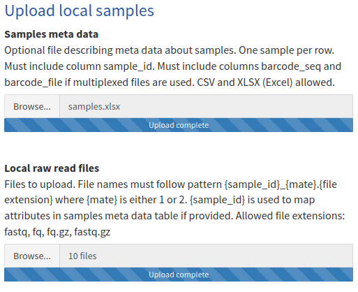

Please wait until all files are being uploaded.
A progress bar underneath the button will be provided to indicate upload status.

### Adding external samples
The other two cohorts have already been uploaded to the NCBI Sequence Read Archive [(SRA)](https://www.ncbi.nlm.nih.gov/sra).
This webserver is able to access this database directly.
We have two options to add samples from external cohorts:

#### SRA Accessions
Every sequencing run stored in the SRA has a unique ID starting with either `SRR`, `ERR` or `DRR` followed by a number.
We must enter one sample per line in the text box `SRA accessions`.
In this example, we insert all 20 fecal samples from healthy individuals:
```
SRR5098710
SRR5098580
SRR5098736
SRR5098677
SRR5098500
SRR5098394
SRR5098370
SRR5098413
SRR5098489
SRR5098436
SRR5098698
SRR5098401
SRR5098363
SRR5098721
SRR5098511
SRR5098498
SRR5098398
SRR5098371
SRR5098341
SRR5098421
```

#### External projects
Many ITS projects of the SRA are already downloaded and preprocessed.
We will select the project [hospital metagenome Targeted loci environmental (PRJNA505509)](https://www.ncbi.nlm.nih.gov/bioproject/?term=PRJNA505509) in the drop down menu `External projects` by clicking at the box and typing `hospital` to search for the study.
Please click <i class="fas fa-database"></i> Projects on the sidebar to browse through all available projects.

We can subset samples from external cohorts by any meta data variable as displayed at <i class="fas fa-database"></i> Projects.
This can be archived using a filter query.
We will enter the query `scientific_name == 'hospital metagenome' & total_spots > 30e3` to the text box `Filter query for external projects`.
This will only include environmental samples of the NICU project which have at least 30*10³ raw reads.
Character strings must be single quoted.
`==` is used to indicate equality.
`>` and `<` can be used to filter numerical attributes.
Single terms can be combined using `&` or `|` to yield the sample-wise intersection or union over these terms, respectively.
Please note that both `%>%` and parenthesis are blocked in this filed for security reasons.
We can always filter samples according to these attributes:
```{r}
list(
  "total_spots" = "Number of raw reads",
  "total_bases" = "Number of raw bases",
  "size" = "File size in bytes",
  "biosample_id" = "NCBI accession of the biological sample starting with SAM",
  "scientific_name" = "Name of taxa of the sample e.g. human gut metagenome "
) %>%
  tibble::enframe(name = "Attribute", value = "Description") %>%
  tidyr::unnest() %>%
  kable(caption = "Attributes available in all external projects to filter samples")
```

A click on <i class="fa fa-plus"></i>Add external samples will add these sample to the project. The column `project` will be filled with the NCBI BioProject id.


## <i class="fas fa-play"></i> Start: Setting parameters and starting the pipeline
First, click on <i class="fas fa-play"></i> Start on the sidebar.
Here we can run the pipeline with default parameters by just clicking on <i class="fas fa-play"></i> Start pipeline.
This will take around half an hour for the example cohort to run on our servers using 5 CPU threads.
Depending on the number of samples and parameters, this can take up to a couple of hours.
Please create a bookmark of the page or remember the project ID to view the results later on.
Results can be accessed on the sidebar above the results menu once analyzed.
We also have the option to create and select own parameter sets.
A complete reference about all input elements and parameters is given at  <i class="fa fa-cog"></i>Reference on the sidebar.
  
### Adjust the parameters
We can customize the analysis workflow by creating our own parameter set for each step.
Each parameter set must be given a unique name consisting of alphanumerical characters and spaces.

> The default ITS sub region is ITS1.
> If you have ITS2 data, you have to adjust the denoising parameter set!

Here, a briefly summary about changed parameters in the example project is given.
A complete description about all parameters can be accessed by clicking <i class="fas fa-cog"></i> Reference on the sidebar.

- Quality Control
  - Aim: Remove sequencing errors by trimming and filtering the raw reads
  - We want to have our own primers ITS3 and ITS4 to be removed. Therefore we enter these primers in the `Sequences to trim` text box:
    ```
    >Forward primer ITS3
    GCATCGATGAAGAACGCAGC
    >Reverse primer ITS4
    TCCTCCGCTTATTGATATGC
    ```
    These sequences must be in FASTA format.
    - To remove the primers on both strands, ensure that the checkbox `Include reverse complement of primer sequences` is checked
- Denoising
  - We will use Amplicon Sequencing Variants (ASV) as a method for denoising. Operational taxonomic units (OTU) can be used as well.
  - Our example project covers the ITS2 sub region. Therefore we click on the radio button `ITS2`.
- Phylotyping
  - Aim of this step: Taxonomic annotation of these denoised representative sequences
  - We stay with the default parameters here
- Feature generation
  - Aim of this step: Normalization, filtering and pooling denoised abundance profiles
  - We stay with the default parameters here. This includes to pool the abundances at genus rank, because many fungal clades can not determined up to the species rank using the ITS region only. However, it is possible to select the species rank if the data is trusted.
- Analysis
  - Aim of this step: Creating statistics, Machine Learning, and correlation networks based on these features
  - Performing statistics and Machine Learning on hundreds of sample attributes can be very time consuming. Therefore, we can select the particular analysis groupings of interest. In this case: `project`, `disease`, and `low_seqdepth`.
  - Building correlation networks on all samples is meaningless in heterogeneous cohorts like ours. We want to compare correlations between healthy and diseased samples. Thus we select `disease` as the correlation grouping.

## <i class="fas fa-receipt"></i> Logs
Once the pipeline has started, we can view the logs of the workflow engine snakemake by clicking <i class="fas fa-shield"></i> Logs on the sidebar.
This is an optional feature of this webserver and useful for debugging processes.

## Result pages
Once a step is finished, a result page will be appear at the results section on the sidebar menu.
All result pages follow the same structure:

- Brief description about the methods and parameters applied
- Results including summary bullet points and interactive figures
- An optional notes section with comments how to interpret the results and which errors might occurred
- A list of literature references of used tools
- Optional panels for interactive analysis and to download the results

## <i class="fas fa-shield-alt"></i> Quality Control (QC)
Quality Control (QC) is the process of removing low quality bases from the raw reads.
This is done by utilizing the Phred quality score as calculated during base calling.
Furthermore, primer and adapter sequences are cut.

This is the first analysis result which will appear at the result section.
The test matrix indicates whether a sample failed, raised a warning, or passed a particular QC test.

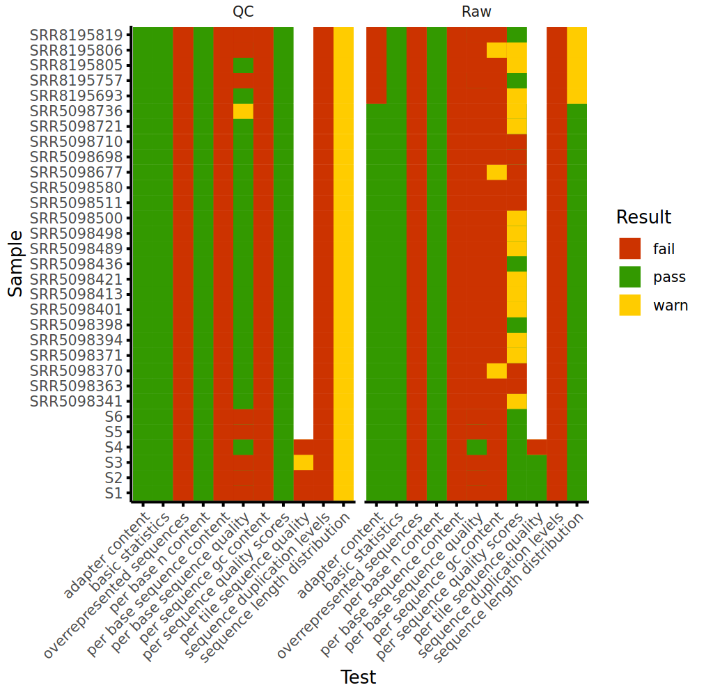

By default and in our example project, samples will be excluded from downstream analysis, if any of these tests failed:

- Adapter content is too high
- Per base N content is too high
- Per base sequence quality is too bad
- Per sequence quality scores are too low
- Minimum number of QC reads < 1000

All tests except the last one are calculated using [FastQC](https://www.bioinformatics.babraham.ac.uk/projects/fastqc/)
In this table we can see that 3 samples were excluded due to too shallow sequencing.
Indeed, samples SRR5098710 and SRR5098580 do not satisfy this requirement even on raw read basis.
They were included in this example project to demonstrate both the functionality of this webserver and the fact that not every sample uploaded in the SRA database is of well quality.

```{r}
example_userdat_dir %>%
  paste0("qc/selected_qc/final/excluded_samples.csv") %>%
  readr::read_csv() %>%
  dplyr::select(-mate_id) %>%
  dplyr::distinct() %>%
  kable(caption = "excluded samples")
```

The effect of QC can be impressively visualized by downloading the MultiQC reports at the bottom of this page [@pmid27312411].
Here we can see that the adapter content and per base sequence quality has been drastically improved after QC.
This is typical for ITS analyzes.
If the length of the ITS sub region is smaller than the fragment length during sequencing, not only the ITS subregion itself but also the adapter of the other read mate is being sequenced.
This results in high adapter content and low sequence quality due to steric hindering during the process of sequencing by synthesis.

| Raw | Clean |
|:---:|:---:|
|{width=100%} | 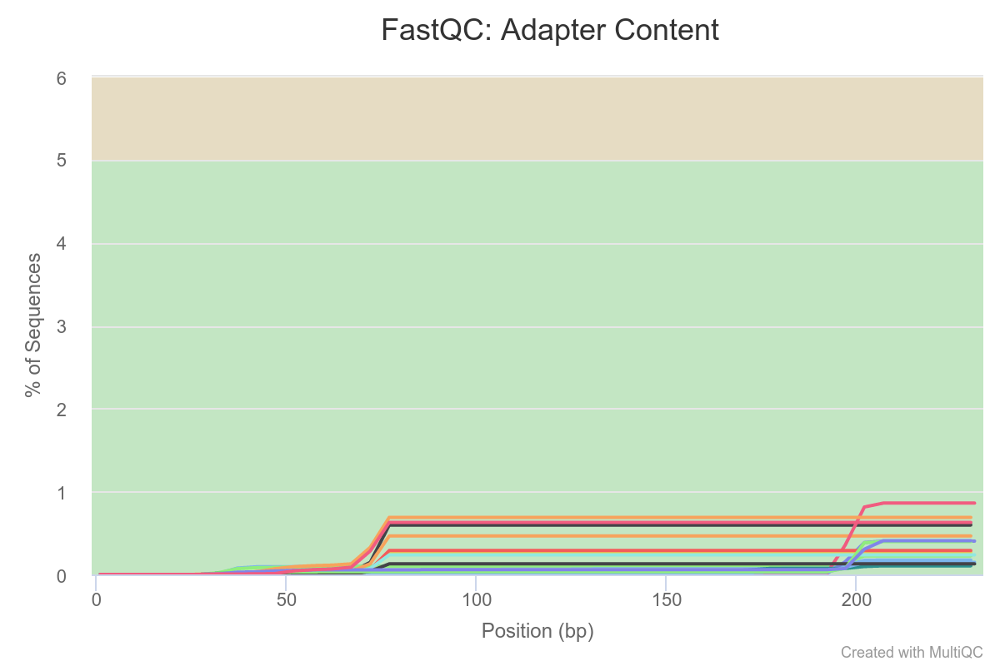{width=100%} |
|{width=100%} | {width=100%} |

## <i class="fas fa-align-center"></i> Denoising
Denoising is the process of identifying correct biological sequences from quality controlled reads.
This is done by removing potential sequencing errors.

As a sanity check, ITSx was used on the ASV sequences to see if the selected subregion ITS2 was indeed present in the raw reads:


A tree of all representative sequences was generated using QIIME2, MAFFT, and FastTree [@pmid31341288; @pmid23329690; @pmid19377059].
Here is a multiple sequence alignment of the 30 most prevalent ASVs:
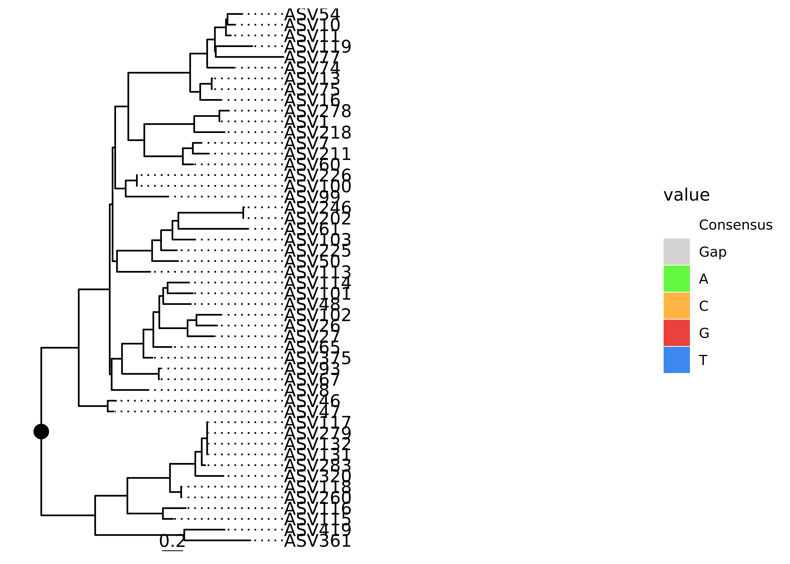{width=100%}
Please note that this tree might not reflect proper phylogeny.
To do so, one need usually a much larger amplicon e.g. a whole subunit of the rRNA genes.
This tree was not used anywhere else in the analysis and is only to visualize differences between all inferred representative sequences.

### DADA2
> This step is specific to ASV profiling.
> They will not be used if OTU profiling was selected in the denoising parameter set.

This webserver process ASV profiling according to the official [DADA2 ITS Pipeline Workflow (1.8)](https://benjjneb.github.io/dada2/ITS_workflow.html) in a sample-wise manner.
Sequencing errors are modeled for each sample and base transition separately.
See the DADA2 paper for more details [@pmid27214047].
Here we can see the distribution of error frequency across all samples corresponding to the consensus quality score:
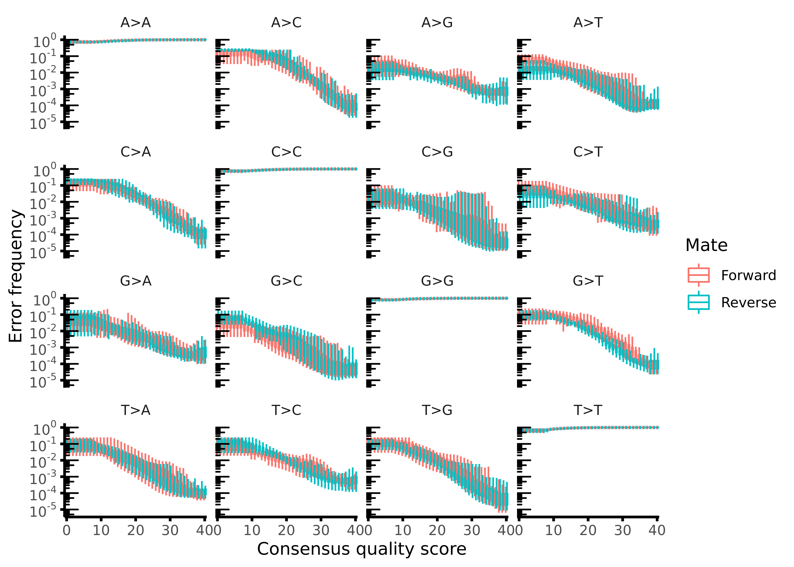{width=100%}

During the steps of the DADA2 workflow, reads undergo additional filtering and trimming.
Not every qc read can be assigned to a final ASV representative sequence.
The read loss can be assessed here:


## <i class="fab fa-pagelines"></i> Phylotyping
Phylotyping is the process of taxonomic annotation of the denoised representative sequences.

59% of the AVS representative sequences were not annotated even at phylum level:


However, taking taxon abundance into account, the majority of the reads are indeed taxonomically assigned: 92% and 94% at species and phylum rank, respectively.
Most representative sequences are unclassified, but very low abundant.
ASV profiling searches for very subtile sequence differences up to a single base.
This results into a larger number of representative sequences compared to OTU profiling.


## <i class="fas fa-chart-pie"></i> Feature generation
Feature generation is the process of pooling denoised sequences at a given taxonomic rank.
Furthermore, abundance profiles were normalized to make them comparable between differentially sequenced samples.

Features can be anything from species abundances to phylum abundances depending on the parameter set chosen.
In our example, we have genus features normalized using centered log-ratio transformation (CLR).
Usually there are hundreds of features remaining after feature generation.
To visualize the abundance of all samples and all features, one can either generate a heatmap or reduce the dimensionality of the data set using a process called *ordination*.
Let's look at the results of the latter one:

|Bray-Curtis | unweighted UniFrac |
|:---: | :---: |
|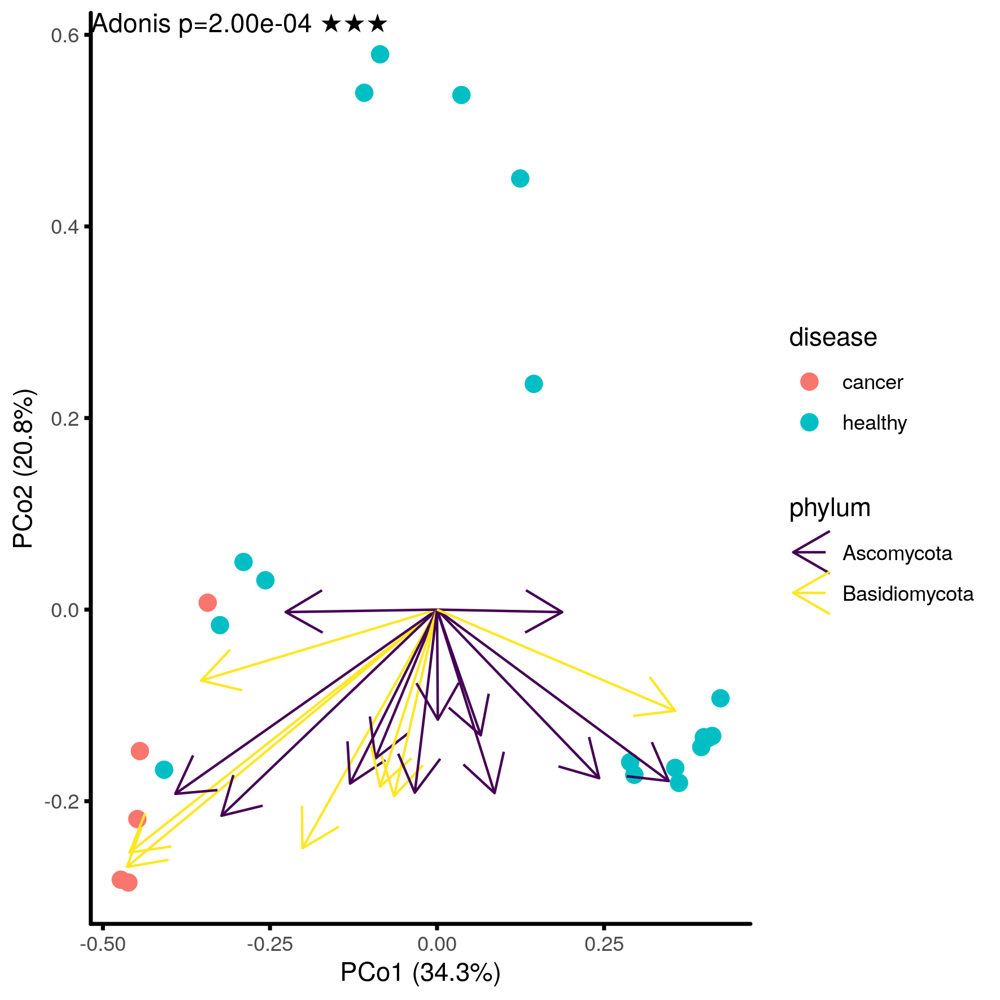{width=100%} | {width=100%}|

The webserver offers an interactive way to create ordination plots.
Sample groupings, dissimilarities and ordination methods can be individually selected.
In this example, Principal Coordinates Analysis (PCoA) using the dissimilarities Bray-Curtis and unweighted UniFrac was performed.

The project groups were significantly differentially abundant in both ordinations (Adonis PERMANOVA, $p < 0.001$).
With UniFrac, however, we are able to explain 54.3% of the total variance in the first ordination axis PCo1.
On the other hand, we can only explain 30.6% of it using Bray-Curtis dissimilarity.
Furthermore, the sample groups tend to be more compact using UniFrac ordination.

Both dissimilarity methods aim to express the distance between two samples considering the abundances of all taxa.
Bray-Curtis treats taxa as disconnected sets, whereas UniFrac takes phylogeny into account.

Let $i$ and $j$ be two sample groups, $S$ the total number of species, and $C_{ij}$ the the sum of the lesser values for only those features in common between both sample groups.
Then the distances are calculated using:

$$
d_{Bray-Curtis} = 1 - \frac{2C_{ij}}{S_i + S_j}
$$

$$
d_{UniFrac} = \frac{\sum \textrm{unshared branch lengths}}{\sum \textrm{all tree branch lengths}}
$$

Both distances do not make a difference *how much* a particular feature is abundant.
They only consider the pure existence.
We can use *weighted* UniFrac to also incorporate abundance.
UniFrac requires a phylogenetic tree.
In this example, the tree consist of the ranks genus, family, etc. up to the kingdom.
The distance of all child nodes to their parents is set to 1.
This is because sequence identity from a multiple sequence alignment of denoised sequences does not correlate with phylogenetic distance in the fungal kingdom using only the ITS region.

## <i class="fas fa-project-diagram"></i> Correlation Networks
Correlation is used to assess co-abundant features.

We used the correlation grouping `disease` which gave us two networks for the healthy and the diseased individuals.
Here is the SparCC correlation network of the healthy individuals with default thresholds for effect size and significance [@pmid23028285; @pmid30169561]:

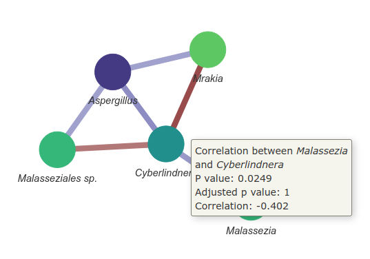

We can hover the cursor over an edge to get a detailed description of the correlation.
Moreover, the network can be also displayed as a table by clicking on the particular tab.

For example, *Malassezia* is significantly negativeley correlated to *Cyberlindnera* ($c_{SparCC}=-0.402, p = 0.0249$).
The p values were obtained using permutation.
Other correlation methods such as BAnOCC provide confidence intervals instead of p values.

### Spurious correlations

> Be always aware of potential false positive correlations.
> These *spurious correlations* can be omnipresent in microbiome data.

The abundance profile of *Dekkera* seems to be highly zero-inflated (see abundance boxplot at section <i class="fas fa-chart-bar"></i> Statistics).
Only one sample got an outstanding high abundance of this genus.
The correlation to *Saccharomyces* we observed above might be driven by this outlier.
It is recommended to use a high prevalence threshold during feature generation.
This implies avoiding the use of Spearman's rho correlation.
Furthermore, one should use a correlation method aware of sparseness (e.g. SparCC) and composition (e.g. BAnOCC).
Different correlation methods can differ drastically in specificity and sensitivity [@pmid26905627].
A review emphasizing issues regarding the compositionality of relative count data is [@pmid29187837].

## <i class="fas fa-chart-bar"></i> Statistics
Here, statistics refers to comparisons of feature abundance between sample groups.

Testing the same subjects multiple times requires *paired* testing.
Subject ids can be mapped to sample ids by providing a column `pair_id` in the sample meta data table.
We do not have to provide this *pairing* information in our example.
We can create box plots with significance labels of any feature and sample grouping:

|Two means comparison | may means comparison |
|:---: | :---: |
|{width=100%}| 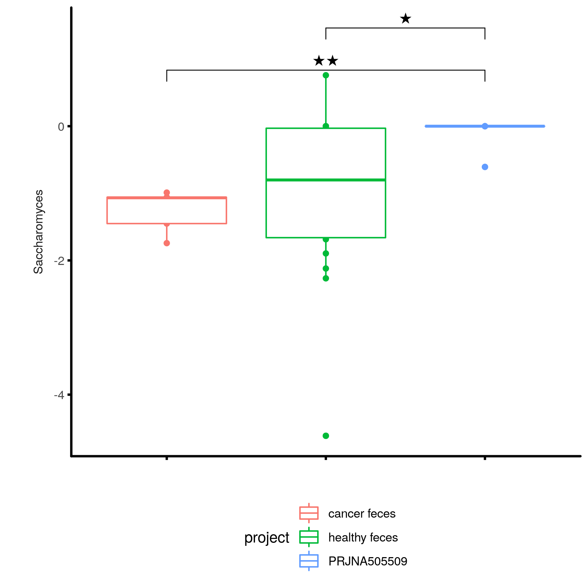{width=100%}|

### Two means tests
Testing differences in the disease grouping is very simple, because disease is a binary variable (it can be either `healthy` or `cancer`)

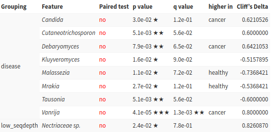

### Three or more means tests
The project sample grouping has three unique levels: cancer feces, healthy feces, and the environmental samples of BioProject PRJNA505509.
We have to apply a two staged test here:
First, Kruskal-Wallis rank sum test on normalized abundances was applied to test if there is *any* difference between the project groups.

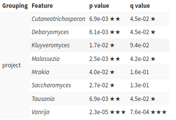

Then, Dunn's test was applied to test *which* groups are significantly differentially abundant.
This is called *post hoc* testing.

{width="100%"} 

## <i class="fas fa-cogs"></i> Machine Learning (ML)
Machine Learning (ML) is the automated process of using features to build a model able to distinguish between any given classes. This model can be used to predict properties of new data sets.

### Model construction
Both random forests and Support Vector Machines (SVM) were used as models.
A random forest consist of multiple decision trees.
Only a subset of samples and features are used in each decision tree.
These models tend to be very robust.
A SVM is a hyperplane dividing the features in two areas.
The feature space was stretched using a Gaussian function (rbf kernel) to account for non-linear relationships.

These models have different hyperparameters to tune:
```{r}
tibble::tibble(
  `Model type` = c("random forest", "random forest", "SVM"),
  Hyperparameter = c("mtry", "ntree", "C"),
  Description = c("Number of variables available for splitting at each tree node", "Number of decision trees", "Regularization penalty for the trade of between low testing and low training error")
) %>%
  kable(caption = "Hyperparameters")
```

Not all features were used in all models:
Feature selection was applied using both recursive feature selection and selection by filtering.
The aim of this subsetting is to prevent over-fitting so that the model generalizes well at the prediction of new data sets.
In recursive feature selection, features are removed iteratively whereas in selection by filtering, ANOVA was used to filter features not related to the property we want to classify.

Each set of hyper parameters and selected features were validated using nested cross-validation.

### Model performance
The sample property we want to classify is called target class.
ML models for all categorical variables of the samples meta data table were trained.
Random forests performed best in the classification of both disease and project sample target property.
Feature selection improved the validation performance: All best models used recursive feature selection.

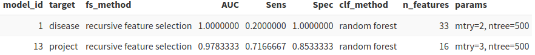{width="100%"}

Multiple metrics were calculated to validate model performance:

- Sensitivity (a.k.a recall or true positive rate)
- Specificity (a.k.a true negative rate)
- Area under the receiver operating characteristic curve (AUC)

Let's imagine a model which classifies all samples with the label cancer.
This model is very *sensitive*: Obviously, all true cancer samples are classified correctly.
But this is also for all healthy samples the case.
This is why the *specificity* of this imagined model is 0.
The performance metric to choose depends on the use case:
We want a *sensitive* classifier for diagnosing a very severe disease for which a drug with no side effects is available.
In this situation we do not care so much about false positives.
However, we should focus on building a *specific* classifier whenever a misclassification has severe implications.

These metrics were generalized for targets with more than two levels (e.g. project):
Here multiple models are trained e.g. cancer vs (healthy and environment together).
Then, the performance values of the "one versus all" statistics are averaged.

### Feature importance
> Feature importance implies neither biological importance nor causality.
> Important features in ML models are only hints for new possible biological insights.

One can also identify features which are important in this classification process.
In random forest models, we can count how often a particular feature was used at any node in the decision trees.
The mean decrease in gini importance is one way to measure this feature importance.
The gini importance value of *Candida* is very high in random forest models classifying the project.
Therefore *Candida* might also play a different biological rule in healthy, cancer, and environmental samples.
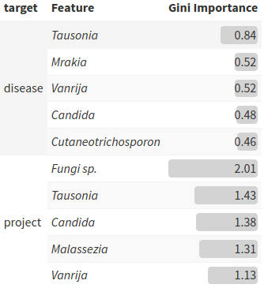


## <i class="fas fa-file-alt"></i> Summary

> You can download the full findings summary
> either as Excel table or HTML report at the download
> section of the Summary webpage.

Here, significant results from all tests are combined.
Furthermore, significant features were annotated with known interactions and related literature.

Let's see whether we have findings for *Wallemia*:


This is a summary of all significant group-wise comparisons and correlations.
Furthermore, features were annotated with FUNGuild and two more databases:
One consist of clinical isolates with suspicious fungal infections from the [NRZMyk](https://www.nrz-myk.de/home.html) reference database.
It can be accessed by clicking at <i class="fas fa-database"></i> Infections on the sidebar.

The other one is about known interactions to other fungi, diseases, and immune system related molecules.
This database was created using manual curation of article abstracts of fungi prevalent in fecal and skin samples.
It can be accessed by clicking at <i class="fas fa-database"></i> Interactions on the sidebar.

## References
